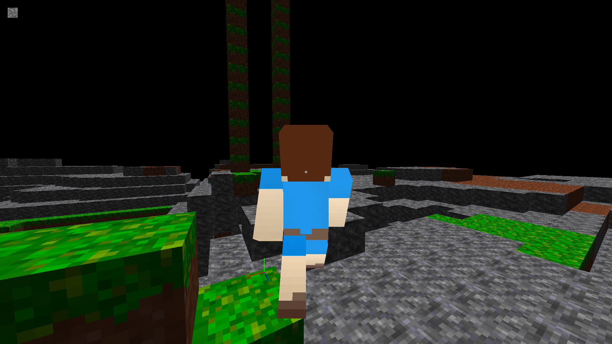

# BlockWeb

Nothing to see here! This ist just another Minecraft clone made with JavaScript und WebGL. No
third-party libraries are being used. Instead all ist written completely from scratch.

Well except for the server I use the "ws" module for WebSockets.

[Play live version on my server](http://h2814415.stratoserver.net:12345)

[Play serverless singleplayer version!](https://guckstift.github.io/BlockWeb)

